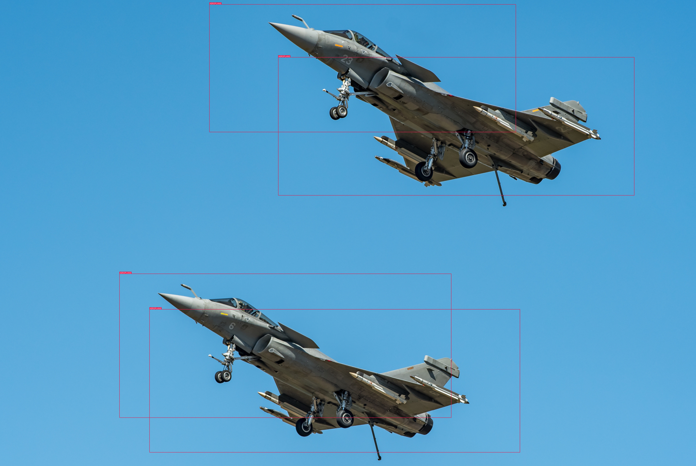

# Utilisation du réseau SSD et évaluation de ses performances:
-------------------------------------------------------------------

## Introduction:

La deuxième partie du travail consiste à mettre en place des tests afin d'évaluer les performances du réseaux SSD. Cette partie plus algorithmique nous a permis d'appréhender les difficultés inhérentes à la mise en place d'un algorithme de deep-learning. Vous retrouverez deux approches différentes présentant toutes les deux un intérêt du fait des questionnements qu'elles ont suscités ainsi que les différents problèmes qu'elles mettent en lumière. Voici une rapide présentation des méthodes et du but de chacune d'elle. La première méthode visait à créer notre propre dataset puis d'entrainer le réseaux sur celui-ci. Elle n'a pas aboutit et nous sommes donc passés à la deuxième méthode qui utilise un réseau pré-entrainé sur les datasets VOC2007 et VOC2012. Nous vous souhaitons une bonne lecture et sommes à votre disposition pour toute question.

# Méthode1: SSD-Tensorflow-On-Custom-Dataset
---------------------------------------------

## Remerciements :
-----------------
Nous tenons à remercier la chaine youtube  Code With Aarohi (https://www.youtube.com/@CodeWithAarohi/featured). En effet c'est sur cette chaine que les ressources permettant de faire fonctionner le SSD ont été trouvées (https://youtu.be/HYWS4jh0i4Y). Vous trouverez ici le lien de son GIT qui nous sera utile pour la suite des manipulations (https://github.com/AarohiSingla/SSD-Tensorflow-On-Custom-Dataset).


## Création du Dataset:

Ce dataset est celui utilisé pour mon projet de traitement d'images. Je l'ai mi au point via https://livingatlas.arcgis.com/wayback/#active=11475 qui m'a permi de récupérer des images sattelites de bateaux. Puis je l'ai annoté sur Chooch IA https://app.chooch.ai. Les performances sur ce dataset avec yolov5 ne sont pas concluante en effet sur la classe sub marine les résultats sont bon cependant les autres bateaux on trop de similitude et je ne fournis pas assé d'image pour bien entrainer le résaux.

## Mise en place de l'environnement et de l'arborescence des fichiers.
---------------------------------------------------------------------

### Mise en place de l'arborescence :

Dans un premier temps ne changez en aucun cas les noms de fichier ou de dossier. Ceci risquerait d'endommager votre installation et de changer les chemins d'accès rendant les codes inutilisables. 
  
  > 1) Cloner ce Git .
  > 2) Cloner le Git suivant (https://github.com/AarohiSingla/SSD-Tensorflow-On-Custom-Dataset) et récupérez uniquement le fichier checkpoint puis placez le à la base de l'arborescence de SSD-Tensorflow-On-Custom-Dataset.
  > 3) Créez un dossier log (VIDE) dans SSD-Tensorflow-On-Custom-Dataset. C'est dans ce dossier que vous trouverez les résultats des trainings sur les différents Batchs.
  > 4) Allez dans le dossier VOC2007 créez un dossier JPEGImages et Annotations (respectez bien ces noms). Vous y placerez vos annotations et vos images.
  > 5) Toujours dans  VOC2007 ouvrez le dossier ImageSets. Vous y trouverez deux fichiers train.text et test.txt supprimez les et recréez les avec les mêmes noms ou videz les simplement en veillant à ne pas laisser de saut de ligne ou autre. Ces deux fichiers txt sont les templates contenant les chemins d'accès aux images d'entrainements et de tests.
  > 6) Enfin allez dans tfrecords et supprimez le fichier. Il sera recréé lors de l'exécution du programme xmltotfrecords_conversion.
  > 7) Renommez le dossier data_unmodified en train_data_pascal
  
  
Si vous avez respecté cette liste d'instructions vos fichiers devraient être bien placés, vous pouvez passer à la mise en place de l'environnement.

### Mise en place de l'environnement :

Dans un premier temps il faut bien comprendre que chaque code ou chaque projet créé utilise des librairies précises, des versions de pythons précises etc que l'on appelle environnement. Il est évident que si vous ne possédez pas le même environnement vous rencontrerez des problèmes de compatibilité et des conflits entre les librairies. Ainsi pour remédier à cela je vous invite à installer la distribution Anaconda via ce lien: (https://www.anaconda.com/products/distribution). Pourquoi Anaconda ? Une fonctionnalité d'Anaconda est la création d'environnements différents sur lesquels il est possible d'installer les versions de notre choix en lien avec notre projet.

Ici nous travaillerons avec:
  > Python 3.6.8                                                                                                                                                 
  > Cuda 10.0                                                                                                                                                   
  > CuDNN                                                                                                                                                       
  > tensorflow-gpu 1.15                                                                                                                                         
    
Voici les différentes étapes à respecter:

  > 1) Installer Anaconda via le lien suivant (https://www.anaconda.com/products/distribution)
  > 2) Ouvrir Anaconda prompt en tapant dans la barre de recherche Anaconda prompt.
  > 3) Ensuite pour créer l'envronnement et installer les différentes versions souhaitées rentrez la commande :
  
  ```python 
     conda create --name env_name python=3.6.8 cudatoolkit=10.0 cudnn tensorflow-gpu=1.15
  ```

  > 4) une fois tous les packages installés il vous suffira de taper la commande suivante afin de l'activer:

  ```python 
     conda activate env_name  (env_name est le nom que vous aurrez choisi)
  ```
    
  > si vous ne vous souvenez plus du nom de votre environnment tapez:
   ```python 
      conda env list #qui vous donnera la liste des environnements que vous aurrez crée
   ```
## Préparation de l'entrainement :
----------------------------------
Dans cette section nous allons préparer toutes les ressources et paramétrer le réseau pour qu'il puisse s'entrainer sur notre dataset. 

### Modification des données :
1) Afin de les rendres plus facilement exploitables il nous faut les renommer. Si vous ouvrez le fichier précédemment renommé train_data_pascal vous pouvez voir que les noms de fichier sont assez indigestes. Je vous propose donc d'ouvrir le programme -Rennomer.py- dans un IDE et de l'exécuter ou de taper les commandes suivantes dans Anaconda prompt. Ce script va renommer tous les couples (Image (jpg), annotations (xml)) avec un numéro unique.

  ```python
     conda activate name_env #activation de l'env du projet
     cd chemin d'accés au dossier SSD-Tensorflow-On-Custom-Dataset #on se place dans le dossier SSD
     python nom_du_script.py  #ici nom_du_script= Rennomer.py
  ```
 2) Par la suite séparez les images des annotations en les mettant respectivement dans le dossier VOC2007/JPEGImages et VOC2007/Annotations.
 
 3) Une fois ces deux étapes effectuées il nous faut créer les templates d'entrainements et de tests. Pour ce faire vérifiez bien que les fichiers txt dans VOC2007/Imagesets sont vides et qu'il n'y a pas de saut de ligne ou autre dans le fichier. Par la suite exécutez le programme split_train_test qui va séparer les images en deux catégories avec un ratio de 20% de manière totalement aléatoire sans répétition. Vous pouvez modifier le ratio en changeant la valeur de la variable split_pct.
 
 ```python
     conda activate name_env #activation de l'env du projet
     cd chemin d'accés au dossier SSD-Tensorflow-On-Custom-Dataset #on se place dans le dossier SSD
     python split_train_test.py  
  ```
  Une fois l'exécution terminée rendez vous dans les fichiers test.txt, train.txt et vérifiez que le nombre total de lignes écrites et de 278 (nombre d'images dans le dataset), qu'il n'y a pas de sauts de ligne.

4) Une fois que cette étape est remplie exécutez le programme xmltotfrecords_conversion. Attention si les autres scripts peuvent être exécutés depuis un IDE; L'exécution de celui-ci doit se faire inpérativement depuis Anaconda prompt. Ce programme va transformer vos annotations au format xml en un fichier tfrecords qui sera idéal pour une exploitation utilisant Tensorflow.

```python
     python xmltotfrecords_conversion.py  #on reste dans l'environnement Anaconda créé et dans le dossier SSD_Tensorflow_On_custom_Dataset
```
   
  ### Paramétrage du réseau :
  Le paramétrage est déjà effectué vous n'aurez donc rien à modifier cependant voyons la méthode à respecter pour changer de dataset.
  
  > 1) Ouvrez le fichier SSD-Tensorflow-On-Custom-Dataset\datasets\pascalvoc_2007.py  dans un IDE python.
  > 2) Le dictionnaire TRAIN_STATISTICS répertorie les classes ainsi que le nombre d'images et le nombre d'occurrences qu'il y a dans la base d'entrainement avec cette classe. Exemple la classe carrier apparait sur 8 images avec 20 occurences. (Notez que pour notre exemple la répartition aléatoire des images imposait de créer une fonction contant les images et les occurrences count_Im_occu.py)
  > 3) Faites la même chose avec le dictionnaire TEST_STATISTICS.
  > 4) Remplacez ensuite dans SPLITS_TO_SIZES  les numéros par le nombre d'images dans votre base d'entrainement et le nombre d'images dans votre base de test.
  > 5) Ensuite remplacez le nombre stocké dans NUM_CLASSES par le nombre de classes qu'il y a dans votre dataset.
  > 6) Ouvrez le fichier train_ssd_network.py dans SSD_Tensorflow_On_custom_Dataset. Allez à la rubrique Dataset Flags et rentrez le nombre de classes à la ligne suivante :
  
```python
        tf.app.flags.DEFINE_integer(
        'num_classes', 12, 'Number of classes to use in the dataset.') #mettez le nombre de classes à la place de 12.
```
   
   > 7) Pour finir toujours dans la rubrique Dataset Flags vous pouvez changer la taille des batchs à la ligne suivante.
   
```python 
    tf.app.flags.DEFINE_integer('batch_size', 10, 'The number of samples in each batch.' )
```
 ## Entrainement du modèle :
 
 Pour entrainer le modèle tapez la commande ci-dessous dans Anaconda prompt:

```python
conda activate name_env #activation de l'env du projet

cd chemin d'accés au dossier SSD-Tensorflow-On-Custom-Dataset #on se place dans le dossier SSD

python train_ssd_network.py --dataset_name=pascalvoc_2007 --dataset_split_name=train --model_name=ssd_300_vgg --save_summaries_secs=60 --save_interval_secs=600  --weight_decay=0.0005 --optimizer=adam --learning_rate=0.001 --batch_size=6 --gpu_memory_fraction=0.9 --checkpoint_exclude_scopes =ssd_300_vgg/conv6,ssd_300_vgg      /conv7,ssd_300_vgg/block8,ssd_300_vgg/block9,ssd_300_vgg/block10,ssd_300_vgg/block11,ssd_300_vgg/block4_box,ssd_300_vgg/block7_box,ssd_300_vgg                     /block8_box,ssd_300_vgg/block9_box,ssd_300_vgg/block10_box,ssd_300_vgg/block11_box
```
## Visualisation des résultats :
------------------------------
 
Comme dit dans l'introduction nous n'avons pas de résultats pour cette méthode en effet le dernier bug a eu raison de celle-ci. Vous devriez tomber sur le même problème. Ayant eu ce dernier bug 2 jours avant la deadline de remise du travail nous avons fait le choix de repartir totalement à zéro malgré le temps passé sur les différents programmes. Cette échec restant un peu cuisant si vous avez déjà rencontré ce genre de bugs nous serions très interessé par une piste de résolution.

Voici le message d'erreur en question:

```python
     File "C:\Users\Legion5\anaconda3\envs\ssd-gpu\lib\site-packages\tensorflow\python\client\session.py", line 1407, in _call_tf_sessionrun
    run_metadata)
tensorflow.python.framework.errors_impl.InvalidArgumentError: Feature: image/channels (data type: int64) is required but could not be found.
         [[{{node pascalvoc_2007_data_provider/ParseSingleExample/ParseSingleExample}}]]
```
Il semble que le problème soit en lien avec les images et donc les fichiers tfrecords cependant la conversion des images en Int64 est bien effectué dans le script
xmltotfrecords.py.

##Conclusion:
 Cette méthode n'a certes pas aboutie, cependant elle nous a permis de comprendre toute la mise en place qui se trouve derrière la conception d'un dataset (ici 278 images), la répartition des données, la gestion des annotations ainsi que la transformation de ces données afin qu'elles puissent être prises en compte par le réseaux SSD sous tensorflow. La mise en place du dataset et sa préparation pour l'entrainement ont permis de développer nos connaissances du language pyhton que ce soit en revoyant des bases ou encore en apprenant à exploiter des fichiers xml ainsi que dialoguer avec le système via la librairie sys (cf Rennomer.py, xmltotfrecords.py split_train_test.py). Cette méthode à donc mis en lumière les aspects en amont de l'entrainement. La deuxième méthode va concerner l'entrainement ainsi que l'étude des résultats.

# Méthode 2: Utilisation du SSD pré entrainé sur les datasets VOC2007 et VOC2012.
---------------------------------------------------------------------------------

## Remerciement:
La mise en place de cette méthode n'aurrai pu être possible sans le travail de sgrvinod  que vous pouvez retrouver dans ce dépot GIT (https://github.com/sgrvinod/a-PyTorch-Tutorial-to-Object-Detection/blob/master/README.md). Cette explication du fonctionnemement du ssd sou pytorch ainsi que le protocole clair et précis permettant l'entrainement nous ont été d'une grande aide.

## Mise en place de l'environnement:
Pour la mise en place des tests il suffit de respecter le readme si joint. https://github.com/sgrvinod/a-PyTorch-Tutorial-to-Object-Detection. Le code pour cet méthode n'est pas fourni car nous n'avons pas effectué de modification sur celui-ci. De plus les seuls modifications à effectuer son sur les datasets (il faut merge les deux fichier VOC2007) et ceux-ci étant trop volumineux nous ne les avons pas remis sur GIT.

## Conditions d'entrainement:

Ce modèle a déjà était entrainé avec les paramètres suivants:

      > gradient stochastique
      > taille des batches: 32
      > learning rate 1e-3
      > momentu 0.9
      > weight decay de 5e-4

L'auteur préconise 80 000 itérations avant de diminuer le learning rate de 90% pour refaire deux passages de 20 000 itérations. Cela revient donc à diminuer de 90% le learning rate à la 154 ème epoch avant de le rediminuer à la 193ème epoch pour ensuite stopper l'apprentissage à partir de la 232 ème epoch. Mais que représentent tous ces chiffres en terme de temps ? L'auteur entraine son modèle sur une carte graphique Titan X et à un temps de 6 minutes par epoch soit 23h.Pour ma part avec les mêmes paramètres l'entrainement pour 1 epoch a duré 5h avec ma carte graphique Nvidia RTX 3060 (ordinateur portable). Ainsi l'entrainement aurait duré 48 jours. La modification des paramètres en passant sur des batchs de 4 a permis de boucler 1 epoch en 2h30. Ce point soulève une notion importante concernant les ressources pour entrainer de tels modèles. En effet hormis le temps pour créer et mettre en place l'entrainement, le temps d'entrainement n'a pas du tout été anticipé. Cependant ces erreurs sont importantes. En effet en tant que futurs ingénieurs ou même stagiaires dans le domaines de l'embarqué il nous faudra prendre en compte tous ces aspects pour proposer et mettre en oeuvre les meilleures solutions et pour les maintenir utilisables au cours du temps. Ainsi l'évaluation de la complexité d'un problème et des ressources à disposition pour répondre à un besoin sera d'autant plus facile grace à l'expérience développée lors de ce genre de travaux.

Ci-dessous les résultats de l'évaluation du modèle après l'entrainement complet à gauche et celle trouvé après le lancement de l'évaluation via le fichier Checkpoint fourni par l'auteur avec un entrainement non terminé.


Précision moyenne pour chaque classe :                                       
                                                                              
| Class | Average Precision |                                                                                                 
| :-----: | :------: |                                                
| _aeroplane_ | 0.7887580990791321 |                                     
| _bicycle_ | 0.8351995348930359 |                                           
| _bird_ | 0.7623348236083984 |                                           
| _boat_ | 0.7218425273895264 |                                             
| _bottle_ | 0.45978495478630066 |                                            
| _bus_ | 0.8705356121063232 |                                             
| _car_ | 0.8655831217765808 |                                            
| _cat_ | 0.8828985095024109 |                                             
| _cow_ | 0.8255912661552429 |                                          
| _diningtable_ | 0.756867527961731 |                                        
| _dog_ | 0.856262743473053 |                                                
| _horse_ | 0.8778411149978638 |                                             
| _motorbike_ | 0.8316892385482788 |                                         
| _person_ | 0.7884440422058105 |                                             
| _pottedplant_ | 0.5071538090705872 |                                       
| _sheep_ | 0.7936667799949646 |                                              
| _sofa_ | 0.7998116612434387 |                                  
| _train_ | 0.8655905723571777 |                                          
| _tvmonitor_ | 0.7492395043373108 |                                          


Précision moyenne pour chaque classe:

| Class | Average Precision |                                                                                                       
| :-----: | :------: |                                                     
| _aeroplane_ | 0.27295053005218506 |
| _bicycle_ | 0.18622413277626038 |
| _bird_ | 0.15427057445049286 |
| _boat_ | 0.12035048753023148 |
| _bottle_ | 0.017395492643117905 |
| _bus_ | 0.05509680509567261 |
| _car_ | 0.3639802932739258 |
| _cat_ | 0.31783974170684814 |
| _chair_ | 0.030391614884138107 |
| _cow_ | 0.3101826012134552 |
| _diningtable_ | 0.021878257393836975 |
| _dog_ | 0.3044545352458954 |
| _horse_ | 0.21808747947216034 |
| _motorbike_ | 0.24866032600402832 |
| _person_ | 0.33471542596817017 |
| _pottedplant_ | 0.1128716915845871 |
| _sheep_ | 0.145915403962133531 |
| _sofa_ | 0.055325289466817017 |
| _train_ | 0.04999971762299538 |
| _tvmonitor_ | 0.13915811479091644 |

          
En partant de ce tableau nous testerons sur une image simple puis une avec beaucoup d'éléments trompeurs au sein de l'image et enfin une image avec plusieurs éléments de la classe. Nous testerons les chats, les chiens, les voitures, les avions et les personnes.

Cette idée est la théorie car en pratique le programme qui marchait jeudi ne marche plus le vendredi matin. En effet il semble qu'il y ait un problème entre CUDA et mon GPU ce qui n'était pas le cas la veille:

voici le message d'erreur:
RuntimeError: Attempting to deserialize object on a CUDA device but torch.cuda.is_available() is False. If you are running on a CPU-only machine, please use torch.load with map_location=torch.device('cpu') to map your storages to the CPU.

Afin de corriger ce bug j'ai désinstallé ma carte graphique puis résintallé avec l'ancien pilote, j'ai deplus désinstallé Anaconda et tout refait mais rien n'y fait le programme ne se lance plus. Ainsi nous avons pu entrainer le réseau sur une epoch et n'avons que cette photo pour les tests ayant par chance effectué un test pour vérifier que tout fonctionne.

<p align="center">

</p>

les paramètres utilisés pour cette détection sont: 
```python
   detect(original_image, min_score=0.2, max_overlap=0.5, top_k=200).show()
```

On peut voir que le détecteur semble observer 4 occurences de la classe avions Ceci est du à la faiblesse de min_score qui permet au detecteur de considérer un partie de l'avion comme un match positif avec la classe avion et une autre partie comme un autre match positif.  


# Conclusion:
-------------

Cette partie d'implémentation ne c'est certes pas déroulé comme prévu et nous n'avons pas pu faire autant de test que nous aurrions voulu. Cependant elle nous donne une première expérience trés formatrice qui nous a permi de comprendre la mise en place d'un tel procédé ainsi que tout les paramètres à prendre en compte. Si nous de devons donner un résultat pour cette phase de test je pense que nous pouvons dire qu'il est important de bien prendre en compte que de tel réseau ne sont utilisable qu'au prix de grande ressource hardware prmettant de les entrainer de manière optimal. Cependant nous avons pu voir que une epoch a suffit à donner des résultats convenables sur certaines classe comme (personn, car ou cat).


